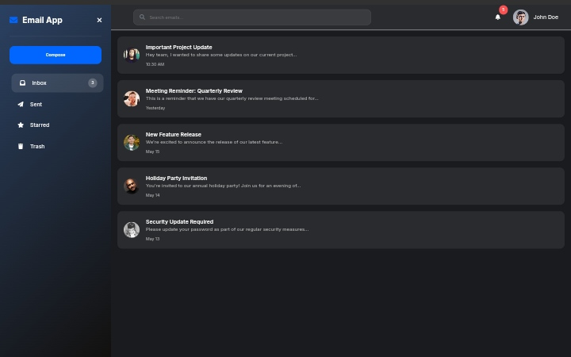

# Email App Dashboard

## Overview

Email App Dashboard - interface for managing emails. It features a responsive layout, a sidebar, a compose email modal, and a list of emails. This is built using HTML, CSS, and JavaScript.

## Technologies Used

- HTML
- CSS
- JavaScript
- Font Awesome (for icons)
- Google Fonts (for typography)

## Getting Started

### Prerequisites

- A modern web browser (Chrome, Firefox, Safari, etc.)

## Contributing
Contributions are welcome! If you have suggestions for improvements or new features, please open an issue or submit a pull request.

- Fork the repository.
- Create a new branch (git checkout -b feature-branch).
- Make your changes and commit them (git commit -m 'Add new feature').
- Push to the branch (git push origin feature-branch).
- Open a pull request.

## License

This project is licensed under the MIT License. See the [LICENSE](LICENSE) file for details.
